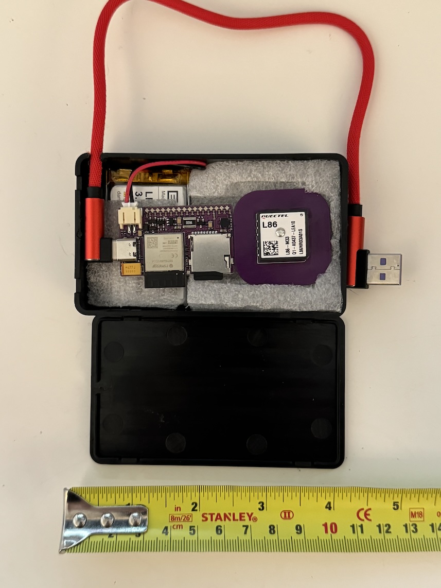

# Case and accessory options

The GPS logger board is designed to be used in your own projects, but here are some options that work well to create a self-contained unit.

## Case options

A small electronics project box [Example here](https://www.amazon.co.uk/dp/B08HLWB9YJ) can be used. The example given fits the battery nicely,
and packed with some foam avoids any rattling. It won't be waterproof, but it makes a neat package about the size of a pack of cards that can
be put in a car glovebox or similar.

It also fits a right-angle USB-C cable such as [this](https://www.amazon.co.uk/dp/B07SX281CH), although this requires drilling a small (~4mm)
hole in the side before fitting the lid.

## Battery

Only tested with a 3.7v 2000mAh 103454 LiPo battery: [Example here](https://www.amazon.co.uk/dp/B08214DJLJ)

Always take care with batteries and consider fire risk, and heat disapation in a confined space.

## Sticking to a window

One appealing option is simply sticking the GPS module to a window with gecko tape. Take care as this can lead to the top of the GPS module actually becoming detached from the GPS module itself, thereby removing its antenna. Putting in a case of some sort, as per 3D print designs, and sticking that to a window is a better option.
